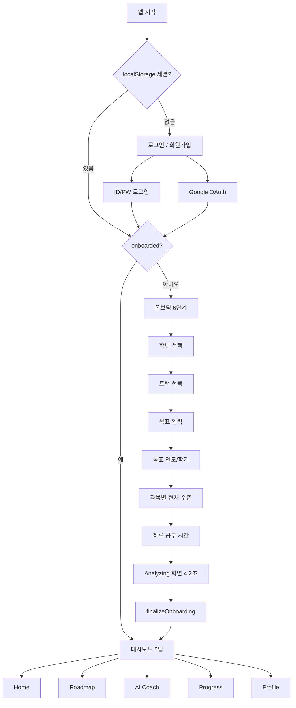

# AI Future Planner — 현재 프로젝트 흐름 정리

> 학생의 장기 목표를 일일 학습 행동으로 바꾸는 AI 학습 플래너 캡스톤 프로젝트  
> 핵심 컨셉: *"5년 후 되고 싶은 나를 위해 오늘 뭘 해야 하지?"* 를 AI가 답해 주는 것

*Last updated: June 2026*

---

## 1. 전체 사용자 흐름

| 단계 | 화면 ID | 역할 |
|------|---------|------|
| 인증 | `s-login`, `s-register` | ID/PW 또는 Google 로그인 |
| 온보딩 | `s-ob1` ~ `s-ob6` | 학년 → 트랙 → 목표 → 기간 → 수준 → 공부시간 |
| 분석 | `s-analyzing` | 로딩 애니메이션 (실제 AI 분석 아님) |
| 메인 | `s-dashboard` | 5개 하단 탭 대시보드 |

---

## 2. 코드 구조 (Vanilla JS 모듈 분리)

단일 HTML에서 **`index.html` + `js/` 7개 파일**로 분리된 상태입니다.

| 파일 | 역할 |
|------|------|
| `data.js` | 트랙별 목표·마일스톤·태스크·과목 프리셋 (정적 데이터) |
| `utils.js` | 화면 전환 `go()`, 탭 전환 `goTab()`, 토스트 |
| `ai.js` | Gemini 2.0 Flash API, 진행률/스트릭 저장 |
| `auth.js` | 로그인·회원가입·Google OAuth·세션 관리 |
| `onboarding.js` | 6단계 온보딩 + `finalizeOnboarding()` |
| `dashboard.js` | 대시보드 빌드 + 5탭 UI |
| `main.js` | 앱 부트스트랩 (세션 복원 시 자동 라우팅) |

**스크립트 로드 순서:** `data → utils → ai → auth → onboarding → dashboard → main`

**데이터 저장:** 전부 브라우저 `localStorage`

| Key | 용도 |
|-----|------|
| `afp_users` | 유저 목록 |
| `afp_sess` | 현재 세션 |
| `afp_gemini_key` | Gemini API 키 |
| `afp_progress` | 일별 태스크 완료 기록 |

---

## 3. 온보딩 상세 흐름

1. **학년** — G7~G12 선택
2. **트랙** — Science, Medical, Humanities, Arts, Business, Study Abroad
3. **목표** — 트랙별 프리셋 또는 직접 입력 (예: "Stanford CS")
4. **목표 시점** — 연도 + 상/하반기
5. **현재 수준** — 트랙별 과목 1~5단계
6. **하루 공부 시간** — 1~2h / 3~4h / 5h+

완료 후 `startAnalyzing()` → 4.2초 애니메이션 → `finalizeOnboarding()`에서 `session.obData` 저장 후 `buildDashboard()` 호출.

> **현재 한계:** Analyzing은 UI만 있고, 실제 AI 로드맵 생성은 없음. 트랙별 **정적 템플릿** (`TRACK_TASKS`, `TRACK_MILESTONES` 등)을 그대로 사용합니다.

---

## 4. 대시보드 5탭 (최신, 2026-06-15 기준)

| 탭 | 기능 | 데이터 소스 |
|----|------|-------------|
| **Home** | 목표 카드, Stepping Stones, 진행 바, 오늘 태스크, 성경 말씀 | `obData` + `TRACK_*` 정적 데이터 |
| **Roadmap** | 마일스톤 타임라인 + 진행도 바 | `TRACK_MILESTONES`, `TRACK_BARS` |
| **AI Coach** | Gemini 채팅 UI | API 키 있으면 `askGemini()`, 없으면 canned 응답 |
| **Progress** | 오늘 완료율 링 차트, 7일 바 차트, 스트릭 | `afp_progress` (태스크 토글 시 저장) |
| **Profile** | 유저 정보, Gemini API 키 설정, 로그아웃 | `session`, `localStorage` |

Home 탭에서 태스크 완료/추가 시 `updateSummary()` → `saveDailyProgress()`로 Progress 탭 데이터가 갱신됩니다.

---

## 5. 인증 흐름

- **ID/PW:** `localStorage`에 평문 저장 (프로토타입 수준, 프로덕션 전 교체 필요)
- **Google OAuth:** `auth.js` + Google Identity Services
  - `file://`에서는 동작 안 함 → **localhost 서버 필수**
  - 2026-06-09 작업에서 origin mismatch 해결, 팝업 차단 이슈는 아직 확인 중

로그인 성공 시:

- `onboarded === true` → `buildDashboard()` + `s-dashboard`
- `onboarded === false` → `s-ob1`

---

## 6. 개발 타임라인 (`work-status` 기준)

| 날짜 | 주요 작업 |
|------|-----------|
| 2026-06-08 | UI 영어화, 성경 말씀 랜덤, 태스크 과목 선택, G7~G12 라벨 |
| 2026-06-09 | Google OAuth 실연동, Apple 제거, `SOCIAL_LOGIN_SETUP_GUIDE.md` |
| 2026-06-15 | 5탭 하단 네비, `ai.js` 신규, Gemini 연동 준비, Progress/Profile 탭 |

---

## 7. 비전 vs 현재 구현 갭

`DEVELOPMENT_PLAN.md` 기준:

| 영역 | 현재 | 목표 (MVP) |
|------|------|------------|
| AI 로드맵 생성 | ❌ 정적 템플릿 | 온보딩 완료 시 LLM이 JSON 로드맵 생성 |
| 적응형 재계획 | ❌ | 미완료 태스크 롤오버/분할 |
| 백엔드 | ❌ localStorage만 | Supabase/Firebase 등 영구 저장 |
| AI Coach | ⚠️ Gemini 준비됨, 키 입력 필요 | 실시간 맞춤 코칭 |
| 진행률 | ⚠️ 태스크 완료 기반 (고정 5% 표시도 있음) | 마일스톤 기반 실제 계산 |
| 보안 | ⚠️ 평문 PW, 클라이언트 API 키 | 서버 사이드 처리 |

---

## 8. 바로 다음에 할 일

- [ ] Gemini API 키 입력 후 실시간 AI 응답 검증
- [ ] localhost에서 Google OAuth 팝업 이슈 해결
- [ ] Progress 탭 — 태스크 완료 시 실시간 연동 마무리
- [ ] 백엔드 연동 계획 (Supabase 또는 Firebase)
- [ ] (장기) `finalizeOnboarding()`을 실제 AI API 호출로 교체

---

## 한 줄 요약

지금은 **로그인 → 6단계 온보딩 → 정적 트랙 데이터 기반 5탭 대시보드**까지 UX가 완성된 **프론트엔드 프로토타입** 단계이고, 다음 핵심은 **실제 AI 로드맵 생성 + 백엔드 영구 저장**으로 넘어가는 것입니다.

---

## 관련 문서

- [제품 비전](./AI_Future_Planner_for_Students.md)
- [개발 로드맵](./DEVELOPMENT_PLAN.md)
- [Google OAuth 설정 가이드](./SOCIAL_LOGIN_SETUP_GUIDE.md)
